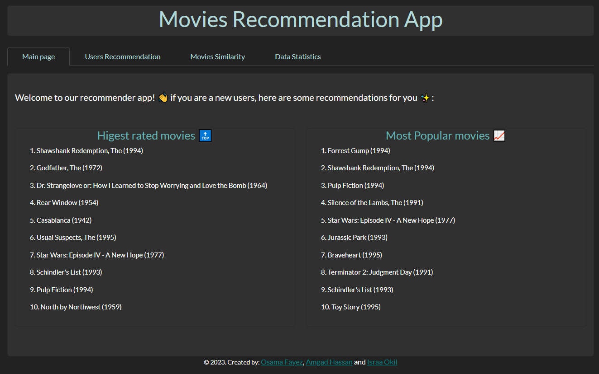
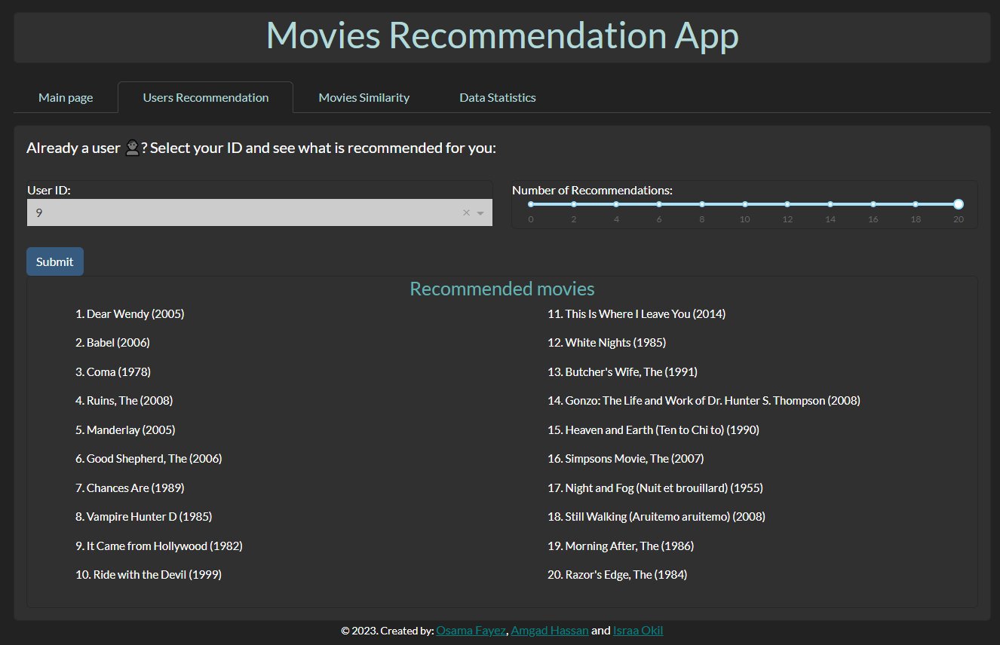
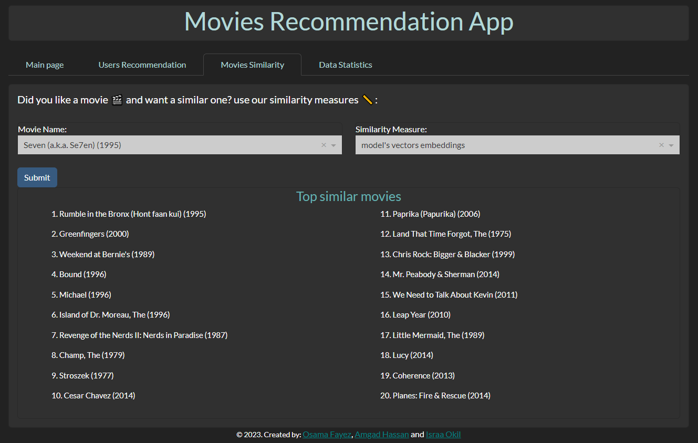
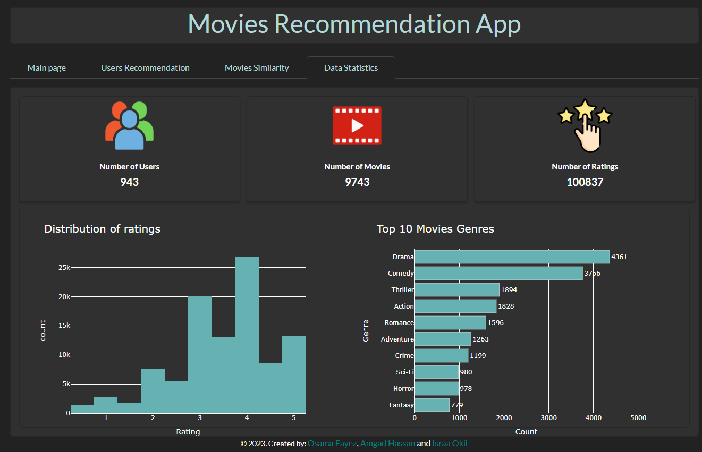

# MovieLens Recommender App

 

### This Project is part of ITI AI 9 Months Program For Recommender systems Course.

 

## Deployed Version
Check the live dashboard on [Render](https://movielens-recommender-system.onrender.com/)

---
 

## About The Project
This is an interactive movie recommender app powered by Deep learning models. It utilizes the MovieLens dataset and provides personalized movie recommendations based on user preferences. The app incorporates a factorization model for user recommendations and various similarity measures to find similar movies.

The factorization model is a collaborative filtering technique commonly employed in recommendation systems. It aims to discover latent features or factors that represent both users and items (movies in this case). By capturing these latent factors, the model can make accurate predictions about user preferences and generate personalized recommendations.

---
 

## Plotly Interface

The app incorporates a user-friendly interface powered by Plotly and Dash. This interface allows users to interact with the machine learning models and obtain personalized movie recommendations. Users can explore different similarity measures, and receive real-time recommendations based on their selections. The interactive nature of the interface enhances the user experience and facilitates easy exploration of movie recommendations.

---
 

## Main Page

When new users access the MovieLens Recommender App, they are greeted with a main page that provides them with initial movie recommendations. These recommendations are designed to cater to users who are new to the app and may not have a well-defined preference profile yet. The main page offers two types of recommendations: the most popular movies and the most rated movies.

---
 

## User Recommendations

The app uses a factorization model to generate personalized movie recommendations for each user. By analyzing user behavior and preferences, the model identifies movies that are likely to be of interest to the user. These recommendations are tailored to each individual and aim to provide a personalized movie-watching experience.

---
 

## Movie Similarity Measures

The app offers several movie similarity measures to find similar movies based on different criteria. These measures include:

1. Model's Vectors Embeddings: This measure utilizes the vector embeddings generated by the machine learning model to identify movies with similar characteristics. It takes into account various features and attributes of movies to determine their similarity.

2. Cosine Similarity: This measure calculates the cosine of the angle between two movie vectors. It determines the similarity based on the orientation of the vectors and is particularly effective when comparing movies with high-dimensional feature spaces.

3. Adjusted Cosine Similarity: This measure adjusts the cosine similarity by considering the average rating given by users. It takes into account user biases and provides more accurate similarity scores between movies.

4. Euclidean Distance: This measure calculates the straight-line distance between two movie vectors in the feature space. It considers the overall differences between the movies' attributes and provides a measure of dissimilarity.

5. Manhattan Distance: This measure calculates the sum of absolute differences between the attributes of two movies. It considers the absolute differences in each attribute and provides a measure of dissimilarity based on the Manhattan geometry.

6. Pearson Correlation: This measure calculates the correlation coefficient between the ratings given by users for two movies. It takes into account the linear relationship between the ratings and provides a measure of similarity based on users' preferences.

7. Mean Squared Difference: This measure calculates the mean squared difference between the ratings given by users for two movies. It quantifies the difference in ratings and provides a measure of dissimilarity.

---
 

## Data Statistics

The app provides various statistics about the MovieLens dataset. These statistics give insights into the distribution of movie ratings, and other relevant information. By exploring these statistics, users can gain a better understanding of the dataset and the underlying trends.

---
 

## Acknowledgments

The MovieLens Recommender App is built using the MovieLens dataset and incorporates various machine learning techniques. We would like to express our gratitude to the developers of MovieLens and the contributors who made the dataset publicly available.

This project is developed by Osama Fayez, Amgad Hassan, and Israa Okil and is for educational purposes only.

---
 

## APP Preview:

 

# Main Page:

---
 

# Users Recommendation:

---
 

# Movies Similarity:

---
 

# Data Statistics:

---
